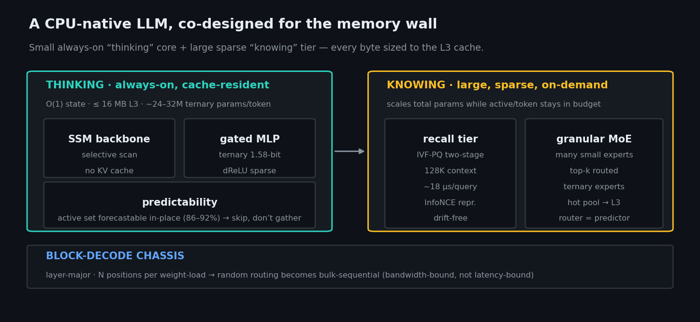
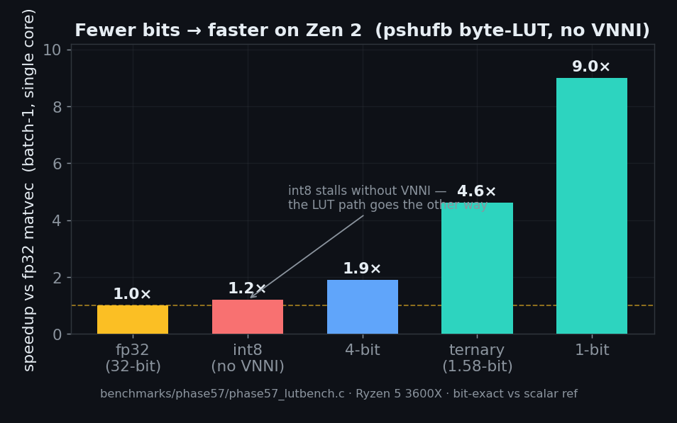
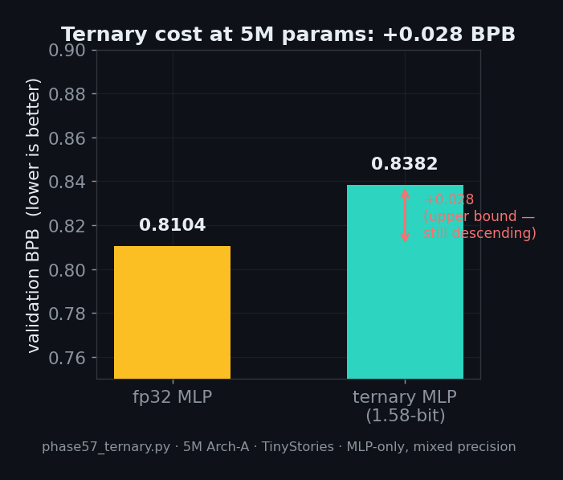
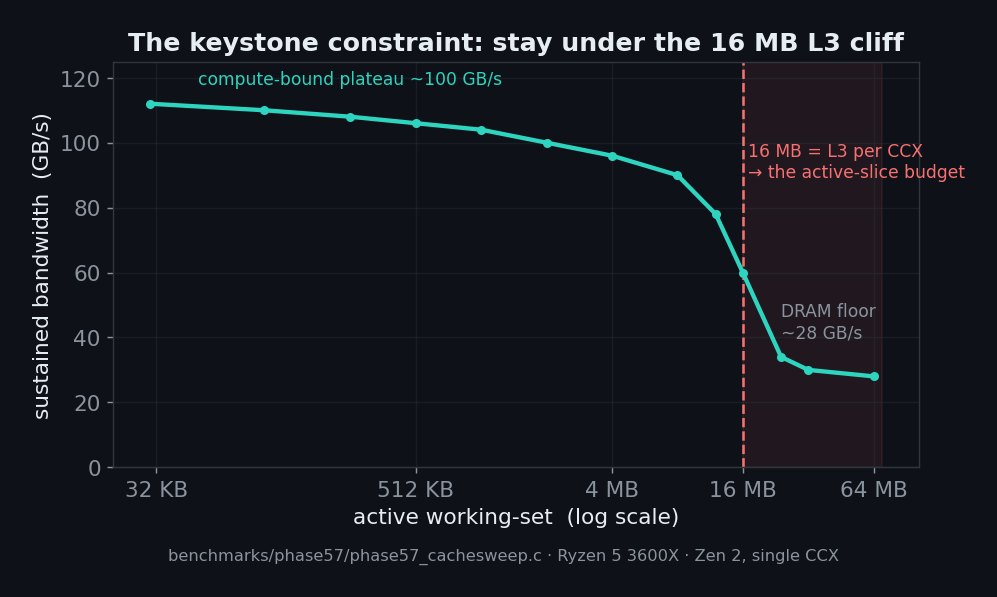
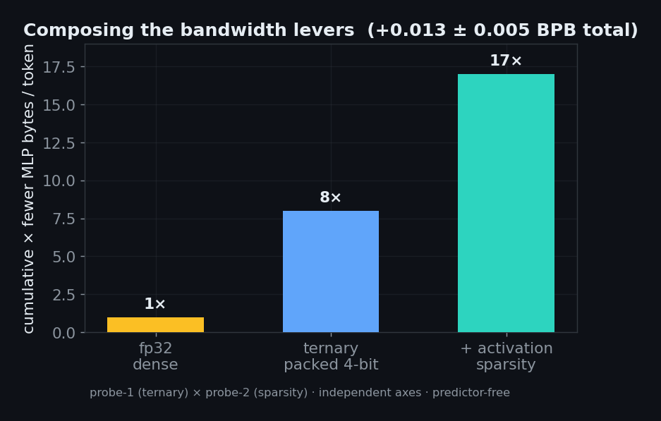
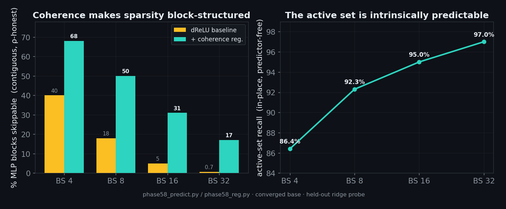
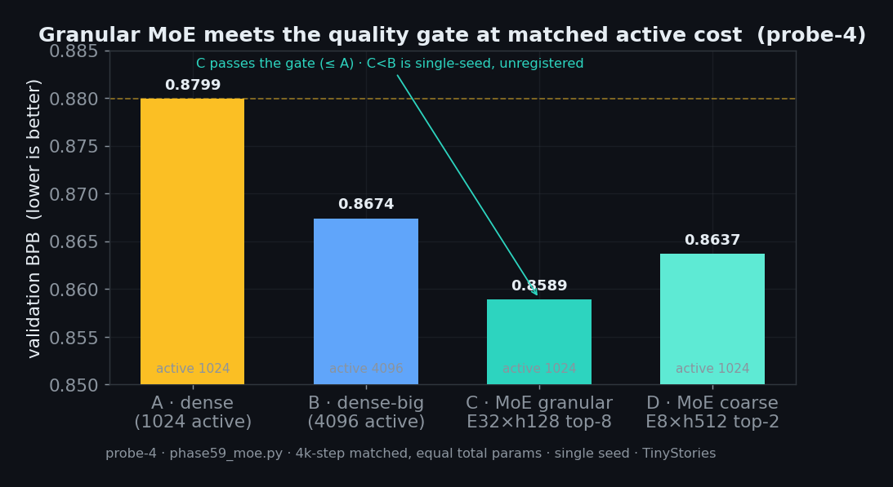
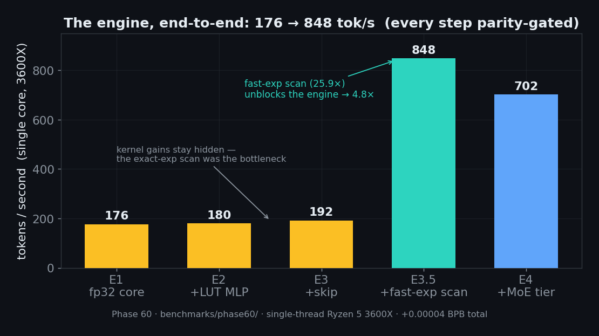

<div align="center">

# Silicon Entropy Engine

### A CPU-native LLM, co-designed for the memory wall

**Making a large, agentic-capable language model fast on a consumer CPU — by architecture, not by brute force.**

[](https://doi.org/10.5281/zenodo.21128459)
[](LICENSE)
[](https://github.com/WildPino/SiliconLLM/releases)
-informational)



<sub>Research project · target hardware: Ryzen 5 3600X (Zen 2, AVX2, **no** AVX-512 / VNNI) · 128K-context goal</sub>

<sub>The diagram is the **target design**; components are at different validation stages (see [Status](#status)) and the recall tier is not yet fused with the engine core.</sub>

</div>

---

## What this is

Modern LLM inference is **bandwidth-bound**: on a CPU you spend most of every token streaming weights from memory, not computing. This project asks a different question than "how do we run a GPU model on a CPU" — it asks **what architecture would you design if the CPU cache hierarchy were the first constraint, not an afterthought.**

The answer is a **split design**:

- a small, **always-on "thinking" core** — an SSM (state-space) backbone with a ternary, sparse MLP, sized to live entirely inside the **L3 cache**;
- a large, **sparse "knowing" tier** — a retrieval index for long-context recall plus a granular mixture-of-experts, which scale *total* knowledge while keeping the *active* parameters per token inside the cache budget.

Everything is held together by a **block-decode chassis** that turns the CPU's worst case (random, per-token memory access) into its best case (bulk, sequential streaming).

> **Honest status.** This is a **research project**, not a finished product. The validated foundation *and* a working single-binary C inference engine (stages E1–E4) have been measured end-to-end on real Zen 2 hardware (below) — every optimization parity-gated against an fp32 reference. What remains is the scale-up frontier: streaming the two-pool architecture at billions of parameters. Every number on this page comes from a real experiment, stated with its honest limitations.

---

## The measured findings

The project advances by **pre-registered probes**: each hypothesis gets a controlled experiment with a gate fixed *before* the results are seen. Here is what has survived.

> **Two caveats that apply to every number below.** (1) All training A/B verdicts are **single-seed** (seed 0); seed variance is not yet characterized — a multi-seed calibration is queued. (2) All properties are measured on **TinyStories at 5–22M parameters**; the declared product domain (Cat-A: code, logs, structured text) is **not yet tested**.

### 1 · Ternary weights are the right call on Zen 2 — and cost almost nothing in quality

Without AVX-512/VNNI, the usual int8 quantization path barely helps (~1.2×, a literature figure — this project measured the ternary and bit-serial LUT kernels, not an int8-dequant arm). A **ternary (1.58-bit) weight** kernel using `pshufb` byte-LUTs goes the *other* way — fewer bits means faster — and every kernel is bit-exact against a scalar reference.

<div align="center">


</div>

Trained from scratch (QAT, not post-training), the ternary MLP costs only **+0.028 BPB** at 5M params on TinyStories — and that is an *upper bound*, since the ternary run was still improving when measured. We ternarize **only the MLP** (the byte-sink), keeping the recurrent backbone in fp32; the ternary gap is known to shrink with scale, so micro-scale is the pessimistic end.

> **On "1.58-bit".** A ternary weight carries ~1.58 bits of information, but the current engine *packs* them at **4 bits/weight** (base-3, g=2 codes); the dense trit-pack (~1.6 bits/weight) is queued. Every streamed-byte figure on this page uses the real 4-bit packing, not the 1.58-bit ideal.

### 2 · Activation sparsity and the L3 cliff

A gated **dReLU** MLP is naturally sparse — up to **92%** of hidden units are inactive per token — at essentially zero quality cost (+0.0006 BPB, matched training). Combined with ternary weights, this compounds along **independent axes** to roughly **21× fewer MLP bytes per token** versus fp32-dense, for about **+0.03 BPB** total. *(The 21× and +0.03 BPB are a composition of two deltas measured separately, at different step counts and recipes — 10.7k-step ternary and 4k-step sparsity; a single-anchor A/B at matched convergence is queued.)*

But sparsity only pays if the *working set* fits the cache. A synthetic sweep on the real 3600X finds a sharp **step at 16 MB — the exact L3-per-CCX size** — below which the CPU is compute-bound at ~100 GB/s, and above which it falls off a cliff toward the ~28 GB/s DRAM floor. **This 16 MB is the keystone constraint** that sizes the entire architecture.

<div align="center">


</div>

### 3 · The active set is predictable — so you skip, you don't gather

Reducing bytes is worthless if the bytes you *do* need are scattered (a random gather defeats the cache). Two findings close this:

- the active set is **intrinsically predictable in-place** — a cheap linear probe on the current state forecasts **86–92%** of the active units (same-layer skip), no special training needed. Predicting the *next* token's active set **ahead of time** (what a streaming prefetch controller would need) is much weaker: **50–63%**. The durable mechanism is therefore the in-place skip, not prefetch;
- a **temporal-coherence regularizer** makes that sparsity **block-structured** (contiguous, cache-friendly) at zero quality cost — recovering the sparsity headline as *real, skippable* blocks rather than a scatter.

<div align="center">

</div>

Together: you can skip ~half the MLP blocks, and cheaply predict *which* half **at the point of use** — the in-place skip is what lets a sparse MLP avoid a random gather. (Skipping *ahead* — prefetching the next token's set — is not reliable here; see the weak ahead-of-time number above.)

### 4 · Long-context recall that fits the budget

A two-stage IVF-PQ retrieval tier answers a query in **~18 µs, measured on a 128K-entry index** on CPU — the *cost* is in budget at 128K. The *quality* is validated on a smaller footing: recall is flat versus distance at **8K in-distribution**, plus a **21× out-of-distribution** proxy and a structural bounded-norm argument (a predicted failure mode — query *drift* over long contexts — is **absent** on this SSM because the state norm is bounded). This is **not yet a direct recall measurement at 128K**. The load-bearing originality is the **learned InfoNCE representation** (not the partition, which can be data-independent and simpler).

### 5 · Scaling capacity without scaling the active cost — granular MoE

A mixture-of-experts grows *total* parameters while keeping the *active* parameters per token inside the cache budget. The pre-registered result: at matched active cost, a **granular MoE** (many small experts, top-k routed) **passes the quality gate** (BPB ≤ baseline + 0.01) and in fact *improves* on the dense baseline — the capacity tier costs nothing in quality. Fine-grained experts beat coarse ones, consistent with the block-structure finding above.

> **Labeled observation (not a registered result).** At matched steps (4k, single seed, heavy undertraining) the granular MoE also *led* the 4×-active dense arm. This is an **unregistered, single-seed observation** — it may reflect training *speed* rather than *capacity*; a multi-seed / convergence check is queued. We do **not** claim "MoE beats a 4× dense model."

<div align="center">

</div>

Routing has **no temporal locality** — the active expert set is i.i.d.-like across tokens (measured twice, at neuron and expert granularity). So the experts do *not* form a hot pool that stays cached; instead they are **streamed from DRAM in contiguous, granularity-bounded chunks** (bulk and sequential — ρ-safe, no pointer-chasing). This splits the memory budget into **two pools**: a resident core (≤ 16 MB L3, reused every token) and a streamed expert tier (a few MB/token at the DRAM floor). That two-pool model is the honest answer to the random-latency concern: no hot pool (measured), but no latency trap either (by construction).

### 6 · The engine runs — end-to-end on real hardware

The point of every probe above is this: a single-binary **C inference engine** that implements the validated architecture. It now exists through stage E4, built **correctness-first** — an fp32 reference core is the permanent regression harness, and every optimization lands only after parity against it is proven (bit-exact kernels, bit-identical logits, or a pre-registered BPB threshold).

<div align="center">

</div>

From an unoptimized fp32 core to the full stack — ternary LUT MLP, exact activation-skip, a deterministic fast-exp scan, and the granular-MoE two-pool tier — the engine reaches **176 → 848 tokens/second single-threaded** on the Ryzen 5 3600X (4.8×), or **702 tok/s** on the better MoE model (−0.021 BPB). The total *inference-time* quality cost across every optimization is **+0.00004 BPB** — essentially free. The honest lesson is in the chart: the MLP kernel wins (E2/E3) stayed hidden until the real bottleneck — the exact-exp selective scan — was replaced by a deterministic polynomial approximation (E3.5, 25.9× on the scan alone).

Scope, as always: at 5M sandbox scale everything is cache-resident, so these numbers validate the engine's *correctness* and *kernel-level* speed — not the streaming bandwidth at scale. The two-pool expert bytes are **counted and priced** (probe-3's 28 GB/s floor), not yet streamed at billions of parameters.

---

## Status

| Component | State | Evidence |
|---|---|---|
| Ternary 1.58-bit LUT kernel | ✅ validated on Zen 2 | 4.2–5.0× matvec, bit-exact, +0.028 BPB |
| Activation sparsity (gated dReLU) | ✅ validated | 92% sparse, 2.12× skip, +0.0006 BPB |
| Cache-residency budget (16 MB L3) | ✅ measured | bandwidth cliff at L3-per-CCX |
| Long-context recall tier | ✅ de-risked end-to-end | ~18 µs/query, drift-free |
| In-place predictability | ✅ validated | 86–92% recall, predictor-free |
| Block-structured sparsity | ✅ found (byproduct) | 18% → 50% skippable @ zero cost |
| Granular MoE (capacity tier) | ✅ validated | granular > dense at iso-active; fine > coarse |
| Two-pool memory model | ✅ characterized | resident core + streamed experts (no hot pool) |
| **C inference engine (E1–E4)** | ✅ **validated end-to-end** | **176→848 tok/s (4.8×), parity-gated, +0.00004 BPB** |
| Block-decode / MTP execution (E5) | 📋 designed | roadmap (execution chassis) |

<sub>Notes: training A/B verdicts are single-seed (seed 0). "Ternary 1.58-bit" refers to the weights' information content; the engine stores them at 4 bits/weight today (trit-pack queued). All measured on TinyStories at 5–22M params.</sub>

See [`docs/SCALEUP_ARCHITECTURE.md`](docs/SCALEUP_ARCHITECTURE.md) for the full buildable blueprint, and [`HANDOFF.md`](HANDOFF.md) for the technical narrative including negative results.

---

## What this is *not* (scope discipline)

- **Not a scale-up speedup yet.** The engine's 176→848 tok/s is real and single-threaded, but at 5M sandbox scale everything is cache-resident — it validates *correctness* and *kernel-level* speed, not the streamed two-pool bandwidth at billions of parameters (which is counted and priced, not yet run). The probes measure architectural *properties*; the scale-up engine is the next frontier.
- **Not a finished LLM.** The current model is trained on TinyStories at 5–22M parameters to isolate architectural questions cleanly. Broad-distribution quality at scale is future work — and the *declared product domain* (Cat-A: code, logs, structured text, where the agentic thesis expects the best acceptance) is **not yet tested**; that probe is queued.
- **Not yet one fused system.** The long-context recall tier (the phase-56 model line) and the engine's thinking core (the phase-58/59 line) are today **two separate lineages**. Unifying them into a single model with a recall slot is future work (E5+).
- **Honest about magnitude.** Individual levers are stated at their *predictor-free, measured* value (e.g. 2.12× sparsity, ~3× residency), never the optimistic ceiling. The compound win is one-to-two orders of magnitude, but no single headline number is load-bearing.

---

## Reproduce

**1 · Regenerate the charts** — the plotted numbers live in the script (sourced from the verdicts), so this redraws every figure on this page:

```sh
python scripts/make_readme_charts.py     # -> assets/*.png
```

**2 · Re-run the kernel microbenchmarks** — no weights needed; these are the ternary-speed and cache-cliff measurements (Zen 2):

```sh
clang -O3 -mavx2 -march=znver2 benchmarks/phase57/phase57_lutbench.c   -o lutbench   -lm
clang -O3 -mavx2 -march=znver2 benchmarks/phase57/phase57_cachesweep.c -o cachesweep -lm
```

**3 · Reproduce the engine parity gates end-to-end** — this needs the trained checkpoints, the engine export, the BPE tokenizer, and the canonical validation slice (with hashes). These are being packaged as a downloadable **release asset** (attached from an upcoming release; large binaries are not tracked in git). With that asset unpacked at the repo root:

```sh
clang -O3 -mavx2 -march=znver2 benchmarks/phase60/e1_engine.c -o bin/e1_engine -lm
bin/e1_engine --all      # runs the G1–G5 parity gates vs the fp32 reference
```

Later stages build the same way (`e2_engine.c` … `e4_engine.c`). See [`docs/ENGINE_PLAN.md`](docs/ENGINE_PLAN.md) for each stage's gates and the exact rerun commands. The probe apparatus (training A/Bs) lives under `benchmarks/phase55-57/`; the engine stages under `benchmarks/phase60/`.

---

## Repository layout

```
SiliconLLM/
├── assets/                     README charts (generated from measured data)
├── docs/
│   ├── SCALEUP_ARCHITECTURE.md   the buildable blueprint (the current design)
│   ├── ENGINE_PLAN.md            C engine stages E1–E5 + pre-registered gates
│   ├── EXTERNAL_REVIEW_01.md     external technical review + responses
│   └── research/                 background research reports
├── benchmarks/
│   ├── phase55/                  CPU SSM language model + C inference kernel
│   ├── phase56/                  long-context recall (IVF-PQ, drift, MQAR)
│   ├── phase57/                  weight-streaming + predictor/MoE/proj probes
│   └── phase60/                  the C inference engine (E1–E4) + gates
├── scripts/                    chart generation
├── archive/                    historical / superseded (compressor + early eras)
└── HANDOFF.md                  full technical narrative
```

<sub>Note: some newer probe apparatus (phase-58/59/61) currently lives under `benchmarks/phase57/` for import convenience; it will be reorganized once Phase 61 finishes running.</sub>

---

## Origin: the Silicon Entropy Engine compressor (archived)

This project began as a **CPU-native lossless compressor** — a streaming mixture of statistical experts blended by an online exponentiated-gradient MoE, shaped by cache topology rather than GPU parallelism. That compressor (V1.0.x, Phases 1–40) is stable and its limits are documented; the token-level and "mantra-pure" eras (Phases 42–54) that followed are the research path that led here. All of it is preserved under the labeled **`archive/`** area as historical / superseded work. The name — *Silicon Entropy Engine* — carried over. See [`CHANGELOG.md`](CHANGELOG.md) for the full phase history.

---

## Citing this work

If this project's findings or design inform your work, please cite it — see [`CITATION.cff`](CITATION.cff) (GitHub renders a "Cite this repository" button). Each release is archived on Zenodo with a DOI:

> **DOI (all versions): [10.5281/zenodo.21128459](https://doi.org/10.5281/zenodo.21128459)** — this concept DOI always resolves to the latest release.

The dated commit history is the record of priority.

## License

Code is licensed under the **GNU Affero General Public License v3.0** — see [`LICENSE`](LICENSE). The documentation and figures are intended for reuse under **CC BY 4.0** (attribution required). If you build on this work, the AGPL's network-use clause applies; for a commercial license, contact the author.
