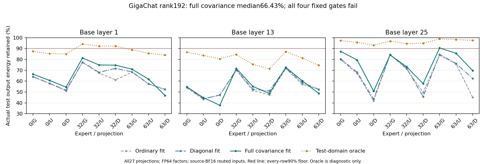

# METH-298: full covariance does not qualify rank192 GigaChat factors

**Decision: reject this fixed full-covariance rank192 representation.**
All four prospectively frozen gates fail on all27 original projection
identities. Full covariance helps many rows but cannot conserve enough
actual distinct-domain output energy. No factor export, rank increase,
threshold adjustment or model promotion follows from these observations.

## Actual input collection and source binding

[Protocol](METH_298_GIGACHAT_FULL_COVARIANCE_PROTOCOL_20261002.md) frozen
at `c20d60e` before collection. Source is GigaChat3.1 Lightning11.480B,
revision `189fff27a1dee68473960c3d5bca53e0e07a3191`, source-BF16 GGUF SHA
`fabc8056f57e230ae9e6aadceb45f4abf9e5d7031fbfe8eca2671d871ef35d47`.
Reuse source-ID calibration domains from181:106 English/code/technical
chunks and125 separate Cyrillic chunks. These are calibration domains,
not fresh full-model heldout quality. All27 raw BF16 tensor hashes,
source index/config and three source shard hashes were reverified.

| Collection | Fit | Distinct-domain test |
| --- | ---: | ---: |
| Real source IDs used | 54,272 | 64,000 |
| Captured routed input records | 67,647 | 47,931 |
| Minimum observations/projection | 711 | 467 |
| Completed capture bytes | 394,697,744 | 279,661,456 |
| Total seconds including binding/audit | 1481.203 | 1464.297 |
| Child seconds including final audit interval | 1228.297 | 1445.578 |
| Observed peak child RSS bytes | 21,289,103,360 | 21,293,760,512 |
| All five capture guards | PASS | PASS |

Both old/new imatrix counts and every channel moment are EXACT; captured
row-order F32 squared sums reproduce new moments EXACTLY. Gate/up inputs
and coordinates are byte exact. All27 present, unique expert/token
coordinates, finite values, full footer/count/EOF and384 floor pass.
Terminal sessions73976 and28420 exit0. The raw captures remain local;
small complete bindings/audits are committed at `ceb7cb6`/`7b55d85`.

Isolated capture compile took9.547s and changes no source graph/operator.
The four-insertion closure is exact **LF-normalized source text**; original
physical CRLF source and generated compilation unit have separate hashes.
All seven existing static libraries,18 headers,compiler/OpenMP library and
executable are pinned in the build manifest. The external build's only
substantive stock-source changes are the existing source-ID imatrix patch
and three-line Windows AMD64 CMake processor detection, not model math.
No GPU/T4/downloads or native timing benchmark overlapped this assay.

## Complete fixed-rank result

All methods fit on the initial domain and evaluate on the SAME actual
Cyrillic projection inputs. Uncentered full covariance uses the leading
192 output eigenvectors; ordinary and diagonal SVD have the same factor
element count. The test-domain optimum is an unattainable evaluation-fit
diagnostic, never used for choosing the candidate factors.

| Actual output-energy fraction | Minimum | Median | Maximum |
| --- | ---: | ---: | ---: |
| Full-covariance fit-domain optimum | 70.737% | 84.795% | 96.177% |
| **Full-covariance factors on distinct test** | **37.820%** | **66.430%** | **90.498%** |
| Ordinary factors on actual test inputs | 41.924% | 57.949% | 84.469% |
| Diagonal factors on actual test inputs | 43.516% | 62.419% | 84.536% |
| Test-domain optimum, diagnostic only | 71.353% | 87.454% | 98.827% |

The median paired full-minus-ordinary gain is3.215percentage points;
full-minus-diagonal is2.554points. The worst paired losses are9.591 and
9.320points, both layer13/expert0/down. These are paired-row medians,
not differences of the marginal median columns. Only1/27 candidate rows
reaches90%; none reaches95%.

All four gates FAIL: median test66.430% <95%; minimum37.820% <90%; worst
loss versus each comparator exceeds0.5point. Direct fit residual/eigenvalue
energy equality and all test-oracle upper bounds pass their1e-8 guards.
Scoring session30065 exits0,168.812s,endRSS1,334,075,392B,within20min/12GiB.
Independent stdlib aggregation verifies all27 identities,summary and gates.

The graph compares identical actual-input metrics. METH-180 Frobenius and
181 diagonal-proxy energy fractions are different estimands and must not
be directly substituted for these values.

## Mechanism boundary and method consequence

Both constraints matter: fit-domain rank192 is already below95% in the
median, and even the evaluation-domain optimum has median87.454%/min71.353%.
Therefore calibration shift alone cannot rescue this fixed linear rank.
The large fit-to-test loss also records meaningful distribution sensitivity.
This is a27-projection linear output screen, not BPB/task/generation proof
or a general rejection of nonlinear, conditional or jointly trained cores.

Hypothetical int8 factor traffic alone would still leave822.29MB/token
with other Q4 organs unchanged, above the560MB streaming allotment. Actual
factor quantization/kernel/DRAM traffic was not measured. The donor's
64 pretrained experts, captured inputs and matrices are real; no new
experts/copied capacity/useful tenfold n or100B compatibility is demonstrated.

Next distinct variable: **state-dependent preservation of original nonlinear
FFN channels on this sparse donor**, using the newly captured down inputs.
Qwen's norm-ranked channel rule failed185; it does not determine this
different family's outcome. Freeze explicit GigaChat retained-channel
counts,output-error gates and static controls before observation. This is
a cheap mechanism screen with no new donor inference. A failure stops a
cheap-router continuation of that specific omission rule; a pass still
needs a costed input-only router and full nonlinear/model/native checks.

## Reproduction and retained hashes

Commands are in the protocol; build/collect/score are write-once. The build
manifest binds local executable/library dependencies; source and captured
raw weights are not distributed by the small JSON records. Assay cost is
3114.312s (51.91minutes) including both collection controllers and scoring,
plus9.547s initial build. This is research cost, not accepted-token speed.

- [Full result](meth298_gigachat_full_covariance_result.json) SHA
  `b0b9a4773b02dc6c309504f2eddc9a8dcc623d115d70c751df9d392219d00223`.
- [Fit capture](meth298_fit_capture_result.json) SHA
  `57cc46da176b6be16953ecfadb21c173d85bb0b8bb6dcc026ddba709fb9c0331`.
- [Test capture](meth298_test_capture_result.json) SHA
  `124610e4ddf83f2f8f5d58bc7465deaebc91183c2452614522cdb1ef4db8f4fa`.
- Initial archive/profile297 stop remains unchanged; no semantic regrading.
