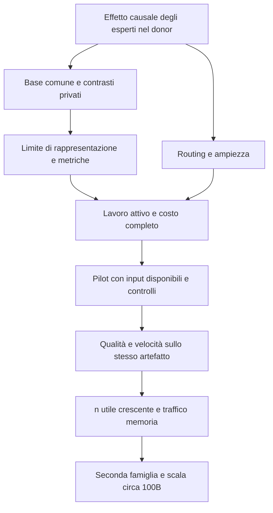

# SiliconLLM: stato scientifico, problemi e vie verso il goal

**4 ottobre 2026 — indagine e pianificazione, senza nuovi esperimenti.**
Base esaminata: `research/native-expert-scaling`, commit `5c82f10`;
donor congelato: `research/donor-adaptation`, commit `90bf9669`.
I numeri sono risultati già registrati. Formule e proposte nuove sono indicate
come deduzioni o ipotesi; nessuna di esse costituisce un risultato sperimentale.

## Sintesi

Il progetto ha costruito un risultato concreto: due sorgenti Switch pretrained,
7,415B e 14,664B parametri, convertite in artefatti C che preservano qualità
entro soglie esplicite e raggiungono almeno 50 ID generati accettati/s sullo
stesso artefatto. Il risultato riguarda infilling inglese breve, con modello
già caricato e input tokenizzati. Il modello 128 supera 50 anche contando
soltanto i token di prosa; il 256 supera 50 contando anche i marcatori
strutturali. È una base reale, con limiti importanti. [S04–S07]

La tesi più ambiziosa resta aperta: trasformare capacità pretrained in un core
compatto con moltissimi esperti utili, mantenendo piccolo il lavoro attivo e
gestibile il routing. L'evidenza mostra che le banche originali Switch sono
causalmente utili, ma non dimostra una crescita monotona della qualità con n.
I tentativi recenti di trasferire funzioni tra due core indipendenti non hanno
conservato la loro specificità: una sola funzione mantiene il 99,6585% del
piccolo beneficio del readout 440. [S08–S10, S17–S18]

La mia diagnosi è che stiamo confondendo tre difficoltà diverse: conservare
la funzione, conservare l'identità condizionale e ridurre il costo fisico.
Un successo locale su una di queste non risolve le altre. GigaChat ha anche
un costo importante del core/MLA; una LUT economica in byte può essere lenta
per il numero di accessi e per la costruzione delle tabelle. [S24–S28]

La via che propongo di privilegiare parte dagli esperti di **un unico donor e
dal suo spazio di rappresentazione**, separa componente comune e differenze
specifiche, e comprime progressivamente il lavoro attivo. L'unione tra core
indipendenti rimane una ricerca secondaria. Prima di investire in training,
servono diagnosi causali, limiti di rappresentazione e conti completi del
costo. Poi occorrono due incrementi di n realmente utili, routing con
ampiezza controllata e verifica completa dello stesso artefatto. Le sezioni
seguenti descrivono prove, algebra, alternative e punti di arresto.

## Perimetro e lettura delle prove

L'obiettivo conserva tutti i vincoli concordati: capacità da un pretrained,
core riutilizzabile, consultazione selettiva, n utile che cresca con la RAM,
qualità rispetto al donor, engine C, almeno 50 token/s sullo stesso artefatto,
più famiglie e scale fino a circa 100B quando praticabile. Il patrimonio
SSM/SWA/LUT resta una risorsa progettuale. Convertire un Transformer in una
ricorrenza SSM è però una trasformazione distinta dalla compressione delle
sue FFN: va trattata come ipotesi specifica. [S01–S03]

Distinguo quattro livelli: **misura** nel suo perimetro; **deduzione** da
equazioni e misure; **ipotesi** da verificare; **proposta** operativa futura.
Più record della stessa coorte o dello stesso artefatto non sono repliche
indipendenti. Le soglie registrate restano autorevoli per la decisione presa,
ma un FAIL locale non prova impossibilità generale. Questo riesame non
riclassifica gli esiti passati e non avvia il test 442. [S02, S23, S32]

## 1. Che cosa abbiamo davvero costruito

### 1.1 Una conversione completa esiste, in un perimetro definito

La catena Switch include identità delle sorgenti, conversione di tutti i pesi,
formato row-I8 con scale F32, attivazioni A16, implementazione C,
confronto con il modello originale, generazione e costo completo. I pesi degli
esperti sono reali e provengono dal pretrained. Non è una dimostrazione
basata soltanto su una matrice sintetica o su un piccolo modello sostitutivo.
La procedura è riprodotta su due checkpoint indipendenti della stessa famiglia.
Questa è la parte più solida del percorso verso il goal. [S02, S04–S07]

| Artefatto | Dimensione sorgente | File target | ID accettati/s | Prosa/s | Lower 95 prosa/s |
| --- | ---: | ---: | ---: | ---: | ---: |
| Switch 128, 3 core fisici | 7,415B | 7,542 GB | 96,56 | 55,98 | 54,60 |
| Switch 256, 6 core fisici | 14,664B | 14,818 GB | 63,53 | 34,78 | 32,65 |

I tempi includono encoder, cross-KV, decoder cached, head, argmax e arresto.
Escludono startup, caricamento, tokenizzazione e serializzazione; il contesto
è breve, S29, quattro span mascherati. Nel 256 i 895 ID accettati comprendono
405 sentinelle; nel 128, 1142 comprendono 480 sentinelle. Sono confini di
misura sostanziali per capire quale prestazione è disponibile. [S06–S07]

Le 18 soglie di qualità coprono probabilità sui token, accordo top 1, risposte
a campi noti, fedeltà della prosa generata e salute delle sequenze. Entrambe
le conversioni passano sulla rispettiva coorte di 24 libri/96 casi. Tuttavia
il donor stesso non è un risolutore perfetto: nel 256 l'esattezza dei campi
generati originali è 18,75%. Conservare quel comportamento è evidenza di
fedeltà, non una certificazione di utilità generale per chat, codice o
ragionamento. Altre lingue, contesti lunghi e altre famiglie restano aperti.
[S04–S05]

### 1.2 Capacità totale e costo attivo sono già parzialmente separati

Nel confronto reale 64→256, gli esperti disponibili quadruplicano e il costo
FULL a lunghezza fissata cresce del 2,91%, con upper 95 del 3,62%. Il decoder
cresce del 0,51%. Il costo del router cresce invece di circa 3,83 volte e
arriva al 3,625% del FULL nel profilo osservato. È un indizio positivo per la
tesi architetturale: la scelta di pochi esperti limita il lavoro delle FFN,
mentre la classificazione piatta mantiene una dipendenza da n. [S10]

La qualità dello stesso confronto è mista. La riduzione a 64 peggiora sia
predizione sia risposte generate. A128, la NLL dei soli token mascherati
migliora rispetto a 256, mentre accordo con l'originale e diversi indicatori
generativi peggiorano. Rimuovere esperti cambia anche normalizzazione e
traiettoria interna. Questo intervento non equivale ad addestrare tre modelli
ottimali con un'unica variabile n. [S09]

**Deduzione:** esiste già un caso in cui molta capacità memorizzata costa
poco lavoro aggiuntivo per token. Manca ancora una curva di capacità utile
che colleghi quel vantaggio a n crescente, a routing efficiente e alla
conservazione del donor. Non c'è una percentuale scientificamente sensata di
“goal completato”: le proprietà mancanti sono congiunte, e una può bloccare
l'intero procedimento. [S01, S08–S10]

### 1.3 Il percorso piccolo ha insegnato qualcosa, ma non sostituisce il grande

La linea dense piccola ha prodotto archivi completi, funzioni condizionali,
prediction e task screen utili. Il candidato C 276 ha però una decisione
semantica negativa: 41 affermazioni unsupported contro 40 del controllo,
pur rispettando gli altri cinque confronti. Il protocollo resta fallito.
Il dato, su un singolo panel anonimo, ha forza limitata per attribuire una
causa matematica generale a una differenza di una affermazione. [S02, S23]

Inoltre quella geometria esegue ancora tutte le 4864 feature FFN source per
layer. I 1280 indirizzi per layer e i 30556 codici distinti complessivi non
dimostrano di aver convertito un grande donor in lavoro attivo piccolo.
Il loader ha 128 parent/10 child fissati e ricerca child lineare. Un'allocazione
RAM maggiore non cambia queste proprietà del programma. [S02, S22]

Questo limita anche la lettura del patrimonio SSM/SWA: abbiamo competenze e
operatori riutilizzabili, ma non una prova che la memoria/attenzione di un
pretrained arbitrario possa essere rimpiazzata senza perdita da quel core.
La mia raccomandazione è conservare la semantica del donor mentre si isola
il problema delle funzioni condizionali; un cambio del meccanismo temporale
richiederà una tappa separata e una motivazione di costo. [S01–S03]

### 1.4 Il ramo donor congelato contiene beni riutilizzabili

Ho letto il ramo `research/donor-adaptation` senza checkout o esecuzione.
Il record finale Giga dimostra 54/64 checkpoint byte-exact nella produzione
di due schedule; il primo residuo rimane la normalizzazione dei pesi scelti.
Attenzione, proiezioni, selezione top 4 e diverse nonlinearità sono già state
isolate. Configurazioni, sorgenti, pesi e catture sono patrimonio utile per
un nuovo percorso compatto. [S33]

Il valore pratico è evitare di ricostruire il riferimento e di riscoprire
gli stessi dettagli numerici. Proseguire automaticamente il vecchio porting
non affronta la riduzione del core attivo né crea molti esperti nuovi utili.
Lo riutilizzerei soltanto per componenti necessari a una trasformazione
esplicitamente motivata e con un nuovo budget. [S01, S27–S28, S33]

## 2. Dove si perde la funzione: coordinate, rappresentazione e identità

### 2.1 I numeri hanno struttura, ma la struttura appartiene al modello intero

Per una FFN ReLU possiamo scrivere, in algebra reale:

\[
F_e(x)=W_{o,e}\,\mathrm{ReLU}(W_{i,e}x).
\]

In Switch quella funzione entra in una somma residuale con ampiezza determinata
dal router. Il resto del modello trasforma la somma in logit. I pesi hanno
quindi significato attraverso l'input su cui operano, la nonlinearità,
l'ampiezza, il residuale e il downstream. Copiare una coppia di matrici tra
due checkpoint mantiene la formula ma può cambiarne completamente l'uso.
Questa è una deduzione dalla composizione, coerente con 401–436. [S13–S15]

Nel tentativo 128→256 tutte 236 matrici comuni nonexpert/nonrouter differiscono.
Identità e varie mappe affini sono state respinte; la shared MLP 435 migliora
il confronto con la sola media, ma fallisce le soglie di ricostruzione.
L'esperimento 436 fornisce addirittura l'input source corretto e non recupera
un beneficio sufficiente con i fattori di output congelati. L'input è un
problema reale, ma non può essere trattato come unica causa. [S02, S13–S15]

**Ipotesi:** trasportare un esperto tra core indipendenti è un problema di
allineamento funzionale distribuito. Una mappa globale su pochi stati può
essere inadeguata perché i due core hanno costruito feature e storie diverse.
La forma delle matrici non garantisce che basti ruotare un asse latente.
Gli esperimenti non escludono altre mappe, altri dati o adattamento congiunto.
[S13–S15]

### 2.2 La simmetria esatta aiuta a capire cosa è trasportabile

**Deduzione esatta:** se P permuta i neuroni nascosti e D è diagonale positiva,
la trasformazione

\[
W'_i=DPW_i,\qquad W'_o=W_oP^TD^{-1}
\]

preserva la FFN ReLU, perché ReLU(DPv)=DPReLU(v). Questo mostra perché
matrici diverse non implicano sempre funzioni diverse. Nel calcolo
quantizzato/F32, il medesimo cambio può però modificare scale e arrotondamenti:
l'identità algebrica non eredita automaticamente la prova byte-exact.

Una rotazione arbitraria T dello spazio **tra blocchi** è una questione più
vincolata. Deve essere compatibile con residuali, RMSNorm con pesi per canale,
attenzione e nonlinearità. Non è lecito allineare una sola matrice e supporre
che tutte le altre operazioni commutino con T. Si possono cercare simmetrie
ammissibili, ma non assumerle per due modelli indipendentemente addestrati.
Questa precisazione restringe un'idea matematica utile senza dichiararla
una soluzione generale. [S13]

Anche nello stesso donor, lo spazio nascosto **interno** dei singoli esperti
può avere permutazioni e scale equivalenti differenti. Prima di mediare pesi
o giudicare il rango dei delta, va separata questa libertà dalla differenza
funzionale reale. Un allineamento ammissibile può rendere la base più leggibile;
non garantisce delta piccoli. È una proposta da includere nell'analisi P2.

**Proposta:** usare inizialmente la base condivisa all'interno di un unico
donor, dove gli esperti ricevono già input nello stesso sistema di coordinate.
Questo elimina dal primo esperimento il problema aggiuntivo dell'unione dei
core. Conservare abbastanza rappresentazione comune può essere più conveniente
che ricostruirla ripetutamente con molti adattatori privati. È un'ipotesi di
progetto, da misurare in costo e qualità.

### 2.3 Il risultato 441 cambia l'interpretazione del readout

L'oracle 433 consente posterior arbitrari: ottiene 17,63% di miglioramento della
cross-entropy miscela rispettando KL medio 256<=.02 e limite per libro<=.05.
Questo dimostra una possibilità **nel problema di output rilassato**. Non
dimostra che un core compatto, un rank fissato e un router disponibile possano
realizzarla. Il divario tra quel limite e il modello addestrato è un problema
di realizzabilità, supervisione e risorse. [S16]

Nel 440 il readout shared rank 32 batte il controllo matched che usa il solo
input; 6/9 soglie di potenziale passano. Ma il miglioramento globale è circa
0,5%, la permutazione delle identità costa solo 0,000156 nats, e 441 mantiene
99,6585% del beneficio usando soltanto expert 0. Rotare gli input fra libri,
mantenendo caso e posizione, costa 0,00003699 nats. [S17–S18]

**Deduzione:** la capacità condizionale aggiunta non è necessaria per quasi
tutto il beneficio osservato di quel checkpoint. Non possiamo dedurre se il
readout abbia cancellato differenze utili o se quel banco/contesto sia un
segnale debole nel donor originale. La rotazione non distrugge ogni forma
di struttura dell'input, quindi non prova indipendenza generale dall'input.
Il test 442 proposto separa queste due spiegazioni e rimane non eseguito.
[S18, S32]

**Ipotesi da distinguere:** il readout può apprendere soprattutto una
correzione comune; il collo di bottiglia rank 32 può attenuare i contrasti;
la loss media può privilegiare errori condivisi; un solo banco finale può
essere una cattura poco rappresentativa. Il parametro “più rank” non separa
queste cause. Prima serve osservare dove i contrasti spariscono.

### 2.4 Conservare il contrasto, oltre alla media

**Proposta matematica:** separare una risposta comune \(\bar F(x)\) dalla
differenza \(d_e(x)=F_e(x)-\bar F(x)\). La media è una definizione funzionale; calcolarla enumerando gli esperti
serve al confronto offline e non è un runtime proposto. Il target di
apprendimento non dovrebbe
premiare soltanto il recupero della media. Può includere l'effetto specifico
di un intervento sull'identità:

\[
\Delta z^{src}_e=z^{src}(h+pF_e(x))-z^{src}(h+p\bar F(x)).
\]

Qui h e p sono quelli dell'intervento fissato. Si confronta il contrasto
source con quello del target, oltre alla loss dei token. Una loss candidata
è \(L=L_{token}+\lambda L_{contrasto}+\mu L_{preservazione}\). I coefficienti,
il costo e i dati andrebbero fissati prima del training; questa relazione
non autorizza una scelta successiva dei pesi della loss.

Prima del fit si può esaminare se le differenze feature source siano presenti
ma finiscano quasi nel nullo del readout target. Per piccoli residuali,
\(\Delta z\approx J(h)\Delta h\); il Jacobiano serve a una diagnosi locale e
non sostituisce il replay nonlineare completo. I gradienti saved-primal/STE
già qualificati sono strumenti locali, non derivate esatte dell'arrotondamento
o della scelta discreta. [S02]

Il controllo minimo resta quello che ha smascherato 440: un'unica funzione,
stesso budget, stesse consultazioni, stessi input disponibili, insieme a
permutazione e rimozione. Se un nuovo metodo supera quei controlli solo con
input/ID/mask oracle non disponibili al runtime, ha risolto un limite di
rappresentazione e non ancora il trasferimento eseguibile.

### 2.5 Base comune più differenze: una strada motivata, con limiti

Per ogni matrice si può scrivere esattamente \(W_e=W_0+\Delta W_e\).
Il beneficio nasce se le differenze hanno una rappresentazione economica,
per esempio \(\Delta W_e\approx U_eV_e\), e la base è riusabile a basso costo.
Questo è un cambiamento rispetto a comprimere direttamente ogni matrice
intera. Il paper D²-MoE studia base condivisa, delta compressi e pruning
strutturato; le sue misure su A100 e throughput batch 64 non qualificano la
nostra CPU batch 1. [S38](https://arxiv.org/html/2502.17298v1)

Nel Giga 298 la rank 192 lineare perde energia importante persino nell'oracle
di dominio test. Nel 316 coefficienti oracle dentro campi già fissati non
ricostruiscono abbastanza la miscela. Quei fallimenti escludono le ricette
misurate, non ogni differenza source-aware, metrica downstream o decomposizione
con nonlinearità conservata. È però necessario spiegare la nuova variabile
prima di riaprire una strada simile. [S24–S26]

**Deduzione:** per ReLU/SwiGLU non vale in generale
\(F(W_0+\Delta W, x)=F(W_0,x)+F(\Delta W, x)\).
La decomposizione matriciale va composta nelle proiezioni prima della
nonlinearità. Nel down, gli input dei diversi esperti possono differire:
condividere W0 riduce storage ma può richiedere più applicazioni. Un risparmio
di parametri non è automaticamente un risparmio di lavoro per token.

**Un riuso algebrico concreto per top-k.** Se tutte le proiezioni down hanno
una base comune, \(W_{down, e}=W_{down, 0}+\Delta W_{down, e}\), allora:

\[
\sum_e p_eW_{down,e}a_e
=W_{down,0}\left(\sum_ep_ea_e\right)
+\sum_ep_e\Delta W_{down,e}a_e.
\]

La base down può essere applicata una volta alla somma pesata delle attivazioni,
anche quando gli a_e differiscono. Analogamente, basi gate/up condivise possono
essere applicate una volta all'input comune, prima delle correzioni private e
della nonlinearità di ciascun esperto. È un'identità in algebra reale, purché
input e basi siano realmente comuni; bias e contributo shared vanno inclusi.
Nel codice quantizzato cambia l'ordine delle somme e può cambiare la
quantizzazione delle attivazioni: serve una nuova prova di qualità.
Questa proposta conserva la nonlinearità privata e rende esplicito quale
lavoro comune si può eliminare. Non assume che i delta siano già piccoli.

## 3. Perché n grande è un problema di ricerca, ampiezza e memoria

### 3.1 La RAM decide lo storage; il resto del sistema decide quanto è usabile

Per geometria e precisione fissate possiamo modellare:

\[
P_{tot}=P_{core}+LnP_{expert},\quad
P_{att}=P_{core,att}+LkP_{expert,att},
\]

\[
T_{token}=T_{core}+T_{route}(n)+T_{LUT}+T_{expert}+T_{head}+T_{mem}+T_{glue}.
\]

Queste sono equazioni di contabilità, non previsioni di latenza: le componenti
temporali possono sovrapporsi, e il riuso cambia i byte effettivi. Mostrano
comunque perché n può crescere con il modello senza far crescere linearmente
il calcolo degli esperti selezionati, e perché router e indice vanno trattati
separatamente. È la proprietà da dimostrare nella nostra macchina. [S01, S10]

L'idea 100B→10 volte gli esperti di 10B è coerente se core, profondità, dimensione
per esperto, precisione e k restano comparabili. Non segue dal solo rapporto
dei parametri dichiarati: un modello può usare il budget per allargare D,
aumentare L o k, o ampliare head/attenzione. Qwen Next è un esempio rilevante:
79,674B main, 48 banche 512/top 10, e 1,279 GB di descriptor attivo nella
rappresentazione ipotetica studiata. Il requisito resta utile; occorre un
criterio di conversione che controlli anche questi gradi di libertà. [S29]

Anche lo storage ha un limite elementare:100B coefficienti a 8 bit richiedono
circa 100 GB prima di scale e runtime; a 4 bit circa 50 GB prima degli stessi
extra. È aritmetica nominale, non una misura di formato o qualità. Gli 80 GiB
del sistema rendono plausibili alcune rappresentazioni compresse, ma non
garantiscono reference, adattamento, buffer e KV contemporaneamente residenti.
[S01, S29]

### 3.2 Il router seleziona un'identità e un'ampiezza

Nel Switchtop 1, semplificando solo la notazione:

\[
e^*=\arg\max_es_e(x),\quad
p_{e^*}=\frac{e^{s_{e^*}}}{Z(x)},\quad
Z(x)=\sum_{e=1}^ne^{s_e(x)}.
\]

La funzione residuale include \(p_{e^*}F_{e^*}(x)\). Una shortlist può trovare
e* e avere comunque Z errato. Il 393 quantifica il problema: a 256, una shortlist
oracle richiede medianamente 140 score e al 95°percentile 191 per stare entro 1%
di errore d'ampiezza. Il 395 non trova una variante fissa I8/refinement che
passi tutti i bank/mode; la riduzione di byte non riduce quel dot work. [S11–S12]

**Deduzione:** aggiungere esperti cambia la funzione anche senza cambiare il
vincitore. Se Znew è la massa delle nuove alternative,
\(p'_{old}=p_{old}Z_{old}/(Z_{old}+Z_{new})\).
Con score uguali, n→10n divide per 10 l'ampiezza del top 1. Non è la previsione
per un pretrained reale; è un controesempio esatto all'idea che il solo k
fissato renda neutrale l'espansione. Un'inizializzazione con massa nuova
limitata, o una modifica addestrata della normalizzazione, rende esplicita
questa transizione invece di nasconderla nel routing.

### 3.3 Due famiglie di soluzione, con garanzie diverse

**Proposta A: selezione con certificazione adattiva.** Approssimare gli score,
con un limite \(|s_e-\hat s_e|\le\epsilon\), e raffinare gli ambigui.
Se il gap tra i primi due score approssimati supera 2epsilon, l'identità è
certificata. Servono però limiti validi, non solo errori medi osservati.
Se le righe router sono raggruppate attorno a un centro c con raggio r,
per Cauchy–Schwarz uno score nel gruppo sta tra
\(c^Tx-r\|x\|\) e \(c^Tx+r\|x\|\).
Da questi intervalli si possono limitare vincitore e massa del gruppo,
raffinando soltanto quando necessario.

È una strada matematicamente verificabile per conservare il router originale,
con fallback al calcolo completo. Nel caso peggiore può restare lineare in n;
la sua convenienza dipende da separazione geometrica, numero di gruppi visitati
e costo degli stessi limiti. Non prometto una ricerca esatta O(logn) universale.
Prima del C vanno studiati gap e larghezza dei limiti sui dati già catturati.

**Proposta B: router gerarchico appreso e normalizzazione esplicita.** Per una
partizione in gruppi g, la distribuzione piatta può essere riscritta
esattamente come \(p(e|x)=p(g|x)p(e|g, x)\), dove il logit di gruppo è
\(\log\sum_{e\in g}\exp s_e(x)\).
Quella riscrittura da sola non accelera: la somma di gruppo è ancora costosa.
Bisogna stimarla, strutturare i logit o riaddestrare il gating. Nasce allora
un modello cambiato, con ampiezza e fedeltà da rivalidare.

Un albero bilanciato con branching b e profondità circa log_b(n) ha costo
nominale O(Db log_b(n)) se si esplora una sola strada per livello. Beam,
candidati multipli e fallback cambiano il costo e la qualità. Il router deve
imparare quale **contributo** serve al target; prevedere l'ID del donor può
essere un proxy debole quando gli esperti sono stati trasformati.
La scelta traA eB dipenderà dai limiti di score/massa e dalla possibilità di
recuperare qualità con dati e training sostenibili. [S11–S12, S16–S18]

### 3.4 La LUT non è il router e non elimina il lavoro attivo

Una LUT di prodotti può ridurre aritmetica delle proiezioni; un indice
gerarchico trova le funzioni da consultare. Sono due oggetti distinti.
Il patrimonio LUT del piccolo modello nativo è valido alla sua scala;
i test 197–200 su grandi pool sintetici hanno avuto problemi di ripetibilità.
Il 200 non consente né un PASS né un FAIL affidabile del rapporto 10x. [S03, S21]

Nel Giga 319 un descriptor 542,987 MB rientra nel budget byte previsto e misura
38–56 ms nel kernel sintetico, sopra 14 ms. Il profilo 302 attribuisce 41,439 ms aMLA,
26,541 ms agli esperti routed e 16,650 ms complessivi alle tabelle. Queste misure
si riferiscono a rappresentazioni definite: non danno un limite universale
alla CPU, ma mostrano che la dimensione compressa è un predittore incompleto.
[S27–S28]

**Proposta di contabilità:** separare costruzione per input, tabelle condivise,
tabelle dipendenti daesperto, numero di gather, decodifica, riduzioni, scale e
head. Nel down, gli input degli esperti differiscono; nel MLA esistono query
distinte. Bisogna contare quante tabelle sono davvero riusabili, insieme
al lavoro evitato dall'identità algebrica della sezione 2.5.

### 3.5 DRAM reale e limite di 20 ms

50 token/s concede 20 ms pertoken nella misura dichiarata, 100 ne concede 10 ms.
La soglia 14 ms degli screen operatore era un budget interno con margine per
altro lavoro; i 560 MB erano un criterio di screening, non una legge fisica
dedotta dalla banda nominale. Un FAIL a 14 ms non prova impossibilità a 50 per
ogni geometria; i costi completi e l'accettazione rimangono obbligatori.
[S01, S28–S31]

Il 373 misura byte logicamente indirizzati, unioni e RSS, ma nessun contatore
hardware DRAM. Una futura misura deve separare pool caldo, pool oltrecache,
page fault e latenze di code/gather; il tool deve supportare questa CPU e
fornire contatori interpretabili. Se ciò non è disponibile, si può usare un
contrasto controllato di working set e dichiarare l'inferenza, senza chiamarlo
misura diretta della DRAM. [S10]

**Deduzione:** la RAM può diventare il limite dominante dello storage solo
se routing, normalizzazione e lavoro attivo rimangono contenuti. La curva
da produrre è qualità/costo/traffico contro **n utile**, e include il costo
di popolazione della banca. Dati e training fanno parte di quel conto.

## 4. Quali strade hanno una motivazione sufficiente

### 4.1 Priorità alta: donor unico, funzioni conservate, compressione progressiva

**Proposta principale.** Partire dal pretrained con la capacità desiderata,
tenere un suo spazio comune e un suo riferimento completo, conservare le
identità originali e ridurre progressivamente il costo attivo. La selezione
della geometria viene dopo aver misurato il contributo comune e privato.
È una strada diversa dall'aggiungere funzioni 128 a un core 256 indipendente.
Il risultato Switch rende questo avvio credibile; non garantisce la sua
estensione a un donor più largo o con più esperti attivi. [S04–S07, S13]

La prima variabile da indagare è la compressibilità delle **differenze** degli
esperti nello stesso donor, con la loro nonlinearità preservata. La base può
essere per banca o pergruppo; i delta possono usare rank, codebook, precisioni
diverse o componenti esplicite per outlier. Il vantaggio va confrontato con
la compressione delle matrici intere e con il modello quantizzato già valido.
Un raggruppamento che riduce costo ma cancella contrasti importanti deve
fallire prima del training completo. [S24–S26]

Non basta verificare varianza o somiglianza dei pesi. Occorre misurare errori
sugli input source e sugli input che il target produrrà, insieme all'effetto
su logit, token e task. La media può rappresentare molte risposte frequenti
e perdere rare risposte decisive. Un obiettivo donor-aware dovrebbe pesare
anche sensibilità downstream e confronti fra identità, con test di dominio
distinto. Questo è un cambiamento di estimand da dichiarare prospetticamente,
senza reinterpretare comePASS298 o 316.

**Criterio di arresto proposto:** se una rappresentazione ottimistica dei delta
non conserva abbastanza effetto source al costo fissato, non spendere un
training per chiedergli di superare quel limite. Se conserva le funzioni
locali ma i costi reali sono fuori budget, cambiare rappresentazione/core
prima di raccogliere grandi quantità di teacher data. I passaggi successivi
devono comporsi nello stesso artefatto.

### 4.2 Priorità alta in parallelo logico: specialisti con un segnale distinguibile

L'E12800 del 176 non dimostra gain utile held-out: il guadagno puntualeBPB
è 0,00011440 e il lowerbootstrap è negativo. Nel 179 la rotta esatta non batte
robustamente le rotazioni child. Sono evidenze contro la ricetta specifica
di popolazione/routing, coerenti col controllo 441, anche se appartengono a
un'altra architettura e a dati diversi. [S19–S20, S18]

**Proposta:** instradare e insegnare il residuale che la componente comune
non spiega. La crescita della banca deve aggiungere funzioni che riducano
errori diversi: contrasti source, competenze/domain documentate o regioni
funzionali selezionate dai dati di training. Un hash-route può distribuire
esposizione senza creare questo legame. Un classifier dell'ID teacher può
apprendere etichette senza predire la funzione migliore nel target.

Nel 433 il classifier raggiunge 83,73% in development e 19,64% in validation;
nel 316,1250/1920 child hanno meno 32 osservazioniFIT e 1381/1920 meno 16TEST.
Una banca enorme con poche osservazioni peridentità può essere un problema
di dati, oltre che di rango. I numeri di quelle ricette non sono una soglia
universale: mostrano perché l'esposizione va contata esplicitamente. [S16, S26]

Se il 100B è già addestrato, le sue capacità non devono essere reimparate da
zero. Ma il procedimento che le rialloca deve conservare abbastanza segnale
per identificarle e selezionarle nel target. Aumentare n a token budget
fissato può diluire quel segnale. Bisogna distinguere confronto a token
uguali, a compute uguale e a esposizione per esperto comparabile.

### 4.3 Priorità media: partizionamento delle FFN, prima esatto poi selettivo

Una FFN si può scrivere come somma di contributi neuronali:
\(F(x)=\sum_jw_{o, j}a_j(x)\).
Partizionare j in gruppi e sommare **tutti** i gruppi conserva esattamente
la funzione in algebra reale. Selezionare pochi gruppi introduce il residuale
omesso. È quindi possibile isolare separatamente correttezza del
partizionamento e costo/qualità della selezione.

MoEfication propone partizioni funzionali e router per FFN pretrained.
D2DMoE aggiunge sparsificazione e selezione dinamica; nei suoi esperimenti
linguistici usa circa 1B token di finetuning e 8–16M perrouter, mantenendo
l'attenzione invariata. Sono riferimenti per una nuova ipotesi, non conversioni
immediate a costo nullo per 10B/100B. [S35](https://arxiv.org/abs/2110.01786),
[S36](https://arxiv.org/html/2310.04361v4)

Il nostro primo controllo dovrebbe usare il contributo di output dei gruppi,
non la sola norma dell'attivazione: i vettori possono cancellarsi e canali
piccoli possono essere downstream importanti. Per SwiGLU le attivazioni non
sono genericamente zeri esatti, quindi l'omissione richiede un'approssimazione
o training. I passati norm-ranking/channel omission falliti non vengono
riaperti senza una nuova regola e un nuovo confronto. [S02, S24]

Questa strada può creare un target granulare source-derived e dare un limite
più leggibile al lavoro attivo. Non garantisce che una quota fissa di gruppi
basti su ogni input. Un k dinamico potrebbe conservare casi difficili ma
spostare costo medio e tail latency; il piano deve fissarne entrambi i limiti.

### 4.4 Priorità successiva: adattamento congiunto di core, esperti e router

Se i limiti locali oracle sono buoni ma il modello disponibile non li realizza,
allora ha senso un fit congiunto con curriculum: prima preservazione del
donor, poi selettività e contrasto, infine quantizzazione/runtime. È una
proposta sostanziale, con bisogno di dati, risorse e verifica degli input
target; non una ripetizione più lunga del 440.

Sparse Upcycling inizializza gli esperti come copie della FFN e continua
l'addestramento. È un modo per riusare costi pretrained, non una prova che
copie iniziali siano nuova capacità. Un'altra analisi di upcycling mostra
trade-off fra qualità e costo inferenza. Per noi il criterio rimane una
banca diversificata utile a costo attivo contenuto. [S37](https://arxiv.org/html/2212.05055v2),
[S39](https://arxiv.org/abs/2411.08968)

Questa strada riceve priorità dopo rappresentazione e costo, perché è la
più onerosa. Un successo su un piccolo proxy conserverebbe valore di metodo,
ma il goal richiederebbe ancora il trasferimento della capacità del donor
grande, senza sostituirlo silenziosamente con uno student più debole.

### 4.5 Unione cross-source e altre famiglie

L'unione 128+256 ha valore come ricerca su interoperabilità delle funzioni,
ma ha introdotto contemporaneamente core diverso, input diverso, readout
diverso, selettore diverso e normalizzazione diversa. Le deduzioni precedenti
mi portano a darle priorità inferiore alla decomposizione di un singolo donor.
Mantengo 442 come diagnosi utile a capire il fallimento del pilot, non come
prerequisito universale per tutta la ricerca. [S13–S18, S32]

Granite, Ling e QwenNext hanno screen concreti; non abbiamo artefatti di
quelle famiglie con qualità e velocità qualificate. Gli screen chiudono
formati/kernel determinati. Qwen 80B richiede anche un riferimento originale
streamed/offloaded ancora da qualificare: i soli header non forniscono
capacità o qualità. [S29–S31]

**Proposta:** scegliere la seconda famiglia per il problema matematico che
mette alla prova il metodo, oltre che per i parametri totali. Un donor con
core attivo trattabile e più esperti reali testa lo scaling; unoSwiGLU/top-k
testa la decomposizione nonlineare; unoSSM/DeltaNet testa la parte temporale.
La tappa 100B va preparata con conti completi e un modo sostenibile di
ottenere reference e conversione, prima di acquisire tutti i valori.

## 5. Piano a decisioni, con problemi piccoli e arresti espliciti

Questo è un **piano futuro**, non un protocollo congelato o un'autorizzazione
ad eseguire test in questa sessione. Le durate sono budget proposti; includere
integrità e setup quando si prepara il protocollo concreto. Nessun numero
di qualità futuro viene presentato come risultato.

### P0 — Consolidamento concettuale, completato in questa indagine

Sono state separate conservazione della funzione, identità condizionale,
instradamento, normalizzazione e costo fisico. Le identità ReLU e il riuso
lineare down sono derivazioni disponibili subito. Il requisito “RAM→n” è
tradotto in storage, lavoro attivo, qualità ed esposizione. I record numerici
restano immutati, il codice 442 rimane una bozza non qualificata. [S01, S32]

### P1 — Scegliere una misura causale source che sappia distinguere identità

**Domanda:** il banco finale originale contiene un contrasto predittivo che
il readout 440 non conserva? Riutilizzo 418/420/441; proposta 442, replay completo
prima di fixed 0/ID+1/rimozione. Budget già proposto 150 sCPU/3 GiB, zero training.
Se fallisce un controllo tecnico, si conserva il primo fallimento prima di
un'eventuale riparazione numerata. [S02, S18, S32]

**Decisione:** effetto originale forte→studiare dove il contrasto viene perso;
effetto locale debole→allargare la diagnosi a più banche/downstream nel donor.
Il secondo ramo richiede un nuovo protocollo e un budget separato. Non
investire in un fit che non può essere giudicato da un probe informativo.
Il 369 già sostiene utilità globale delle banche: un 442 debole non lo annulla.

**Nota di readiness:** la bozza 442 contiene un uso errato di
`parent['data']['validation_positions']` come iterable; nel record441 è il
conteggio 336. Va corretto prima del freeze, insieme a protocollo e binding.
È un rilievo statico dell'indagine, non un fallimento sperimentale 442.
La correzione proposta è verificare i conteggi 1008/336 e confrontare le keys
con `parent['data']['keys'][1008:]`, prima di qualsiasi import o esecuzione.
[S40–S41]

### P2 — Identificare la parte privata comprimibile di un unico donor

**Domanda:** esiste una rappresentazione base+delta che conserva contrasto
e funzione a costo minore? Preparare un singolo banco/layer source,
input source già catturati, confronto matrici intere vsdelta, split di
documenti/domino fissato. Per Giga, i target 314 sono riutilizzabili ma
source-conditioned e non coprono tutti i layer. [S24–S26]

Prima: contabilità di base/delta, nonlinearità e input comuni; analisi di
esposizione e scelte di metriche. Poi un limite ottimistico sull'errore e sul
contrasto, senza router appreso. Budget iniziale proposto 20–30minCPU, un
perimetro singolo, arresto su memoria/costo/errori fissati. Non fare una griglia
estesa. Se fallisce il limite ottimistico, cambiare rappresentazione.

**Decisione:** buona compressione della media ma cattiva dei contrasti→tenere
più componente privata o cambiare metrica; buoni contrasti ma base troppo
costosa→gruppi/basi più piccole o altra geometria. Il rank non è scelto per
massimizzare un score osservato di validation. Questo evita di ripetere 298
con un rango diverso senza una nuova ipotesi.

### P3 — Router e ampiezza, con costo crescente sotto controllo

**Domanda:** preservare gating originale con bound/fallback o apprendere una
gerarchia costa meno al livello di n richiesto? Iniziare da 393: distribuzione
dei gap, limiti di gruppi e massa tail. Nessun training per la diagnosi
certificata; budget proposto<=20minCPU e un solo schema di bound.
Il dato derivato serve a scegliere la famiglia di router. [S11–S12]

**Decisione:** bound utili→candidato adattivo con contabilità worst-case e
fallback; bound troppo larghi→router gerarchico/gating cambiato con distillazione
e normalizzazione esplicita. Si valutano ID, ampiezza, funzione risultante e
tail latency. Un ulteriore score medio favorevole non basta a promuovere
qualità del modello.

### P4 — Chiudere la fattibilità del lavoro attivo prima del fit oneroso

**Domanda:** il candidato completo può rientrare nel budget 20 ms, compresi
core/head/routing/consultazione? Riutilizzare costi qualificati solo nei
componenti realmente invarianti; per una nuova decomposizione servono nuovi
screen, non somme fra profili diversi. Fixture source-shaped possono
respingere un formato, ma non dimostrano conoscenza trasferita. [S27–S31]

Budget proposto 5–15min per uno screen nativo definito, con tutte le ripetizioni
e output conservati. La nuova variabile dev'essere strutturale: lavoro base
riusato, precisione/packing diverso, meno operazioni attive o query più piccole.
Evito tuning generico di attese/affinità/LUT per una ricetta già chiusa.
Includere normalizzazione e costruzione tabelle nel tempo.

### P5 — Un pilot apprendibile che richieda davvero più funzioni

Solo dopoP1/P2/P4 informativi: fit fixed-budget su un perimetro trattabile,
con input runtime disponibili, perdita token+contrasto+preservazione,
controlli same-budget di sola componente comune e singola funzione.
Richiedere beneficio su validation esclusa per documento, oltre a danno da
permutazione/rimozione e copertura delle identità. Si fissa un'unica ricetta
con un arresto di tempo e un criterio per decidere se continuare.

Questa tappa può richiedere ore; **non è avviata né stimata come lavoro
gratuito**. Il protocollo futuro dovrà quantificare token, GPU/RAM/optimizer,
esposizione, costo di teacher e perimetro. Se ricompare un beneficio spiegato
da una funzione, si chiude quella ricetta prima di n×10.

### P6 — Composizione e due aumenti di n prima della tappa 100B

Ottenuto un pilot utile, esportare il modello completo, verificare probabilità,
generazione e task rispetto al donor su nuovi dati, poi velocità sul medesimo
hash. Per lo scaling usare almeno due incrementi reali di banca a k/core
controllati, dichiarando le variazioni inevitabili, dati e compute. Nei modelli
pretrained indipendenti il confronto è di applicabilità, non un effetto
causale puro di n. [S01, S09]

Misurare il routing e la LUT sul percorso realmente usato, traffico fisico o
proxy dichiarato, pool oltre cache, storage/residenza, TTFT, decode e contesti
più lunghi. Le sotto-banche 64/128 già studiate sono controlli riutilizzabili
di correttezza/costo; non si riusano le loro vecchie coorti per selezionare
nuove soluzioni. Poi scegliere seconda famiglia e scala 100B mediante screen
source/costo/reference, senza scaricare il modello grande “per vedere”.

### Mappa delle dipendenze

Le attività possono avere analisi indipendenti, ma iPASS non si ereditano
attraverso un componente cambiato. Il successo di ciascuna tappa deve indicare
quale input/output rende concretamente disponibile alla successiva.

## 6. Limiti dell'evidenza e correzioni al metodo di lavoro

**Dipendenza dai dati.** Switch positivo usa infilling inglese breve. Molte
diagnosi 418–441 derivano dagli stessi prefix e dal medesimo banco finale,
con 1008 posizioni development/336validation; un nuovo numero di esperimento
non aggiunge indipendenza. Le metriche oracle sono informative sui limiti,
ma non sulla capacità disponibile a runtime. [S04–S05, S16–S18, S32]

**Soglie e significato.** Mantengo iFAIL delle ricette originali. Una soglia
può essere conservativa o piccola rispetto all'incertezza del task:41vs 40
unsupported non prova una legge sulla precisioneCPU. Analogamente 0,000114BPB
favorevole senza lower positivo non prova incremento di capacità. Occorre
riportare effetto, incertezza e decisione separatamente. [S19, S23]

**Statistica e selezione ripetuta.** Bootstrap perbook evita di contare token
correlati come repliche, ma 24 unità danno una risoluzione limitata. Le molte
ipotesi sviluppate con gli stessi dati devono essere verificate su nuovi
documenti e task. La conservazione di hash/primi fallimenti sostiene
provenienza e riproducibilità; non corregge da sola questo rischio scientifico.
[S04, S09–S10, S19]

**Misura della qualità.** Accordo top 1 misura fedeltà, NLL distribuzione,
generazione salute e task utilità nel dominio. Nessuna sostituisce le altre.
Per i prossimi candidati manterrei donor-relative fidelity e aggiungerei
test informativi su competenze rare e documenti/domain distinti, scelti
prima degli output. Un umano indipendente è desiderabile per concludere
sulla qualità semantica generale; i panel singoli rimangono screen. [S23]

**Tempi e byte.** Descriptor, RSS, union di regioni e banda nominale sono
oggetti diversi. I costi synthetic sono utili per decidere di non investire
in un formato, ma non diventano automaticamente tok/s di un modello.
I risultati positivi di velocità richiedono l'artefatto completo e la
stessa politica di accettazione della qualità. [S06–S07, S10, S27–S31]

**Costo della ricerca.** Le molte riparazioni numeriche hanno prodotto
strumenti importanti, ma la quantità di record non misura avanzamento verso
il goal. Propongo di mantenere un harness riutilizzabile percomparatore,
derivata locale, serializzazione e risorse; congelare la parte nuova prima
degli esiti; distinguere stop tecnico da esito scientifico. Ogni nuovo test
deve cambiare una decisione architetturale o rendere un passaggio del metodo
eseguibile. Non riscrivo protocolli o risultati già congelati. [S01–S02]

**Graphify.** Non vedo un beneficio operativo per questa indagine che richieda
un aggiornamento del grafo: record identificati e riferimenti diretti sono
sufficienti. Mantengo la scelta già adottata di usarlo soltanto su richiesta
esplicita relativa al grafo; nessun aggiornamento è stato avviato.

## 7. Conclusione e raccomandazione

Le evidenze positive sostengono la separazione fra capacità memorizzata e
lavoro attivo in un donor MoE reale, e un procedimento completo su due scale
Switch. Le evidenze negative identificano tre ostacoli: trasferimento fra
core non allineati, differenze condizionali troppo deboli nelle ricette
apprese, rappresentazioni compatte che hanno ancora troppo lavoro attivo.
Nessuna di queste equivale a “i numeri non hanno struttura”. [S04–S18, S24–S28]

La scelta che farei è **source-first, donor unico, base comune più componenti
private**, con nonlinearità conservata e supervisione dei contrasti. Router
e normalizzazione sono un secondo problema esplicito; costo complessivo e
DRAM sono un terzo. La tappa cross-source 384 resta diagnostica e secondaria.
Un 100B con 10 volte il n diventa un obiettivo testabile quando queste tre parti
si compongono e due aumenti reali di n producono capacità utile.

Non abbiamo ancora le prove per promettere quel risultato, né una
dimostrazione che sia impossibile. Abbiamo abbastanza evidenza per scegliere
le prossime domande e smettere di spendere lavoro sulle ricette che non
conservano identità o non entrano nel budget. In questa sessione sono stati
prodotti soltanto questo riesame e il piano, senza nuovi fit, forward,
benchmark o acquisizione di dataset/pesi.

## Bibliografia e provenienza

Gli ID Sxx citati nel testo identificano le fonti seguenti. Le sigle in
intervalli includono tutte le fonti fra i due estremi. Il dettaglio atomico
è conservato in [sources.jsonl](STRATEGIC_REVIEW_20261004_EVIDENCE/sources.jsonl),
[evidence.jsonl](STRATEGIC_REVIEW_20261004_EVIDENCE/evidence.jsonl) e
[claims.jsonl](STRATEGIC_REVIEW_20261004_EVIDENCE/claims.jsonl).
I paper motivano proposte; i risultati del nostro progetto provengono dai
record locali, senza trasferire misure di hardware o task al nostro sistema.
Il paper Switch è il riferimento architetturale della separazione sparse
fra parametri memorizzati e attivi. [S34](https://arxiv.org/abs/2101.03961)

- **S01** — [Obiettivo concordato](C:/Users/giosa/.codex/attachments/6359009a-bac9-4073-a714-3fb7f7537b80/goal-objective.md). Record primario di progetto; OBIETTIVO FINALE; TESI ARCHITETTURALE.
- **S02** — [Metodo in costruzione](METHOD.md). Record primario di progetto; Current qualified route; Current routing uncertainty.
- **S03** — [Prior evidence](PRIOR_EVIDENCE.md). Record primario di progetto; Evidence ledger.
- **S04** — [Switch256 qualità](METH_363_SWITCH_ALL_A16_MULTI_SPAN_QUALITY_RESULT_20261004.md). Record primario di progetto; Paired results; Decision and limits.
- **S05** — [Switch128 qualità](METH_387_SWITCH_BASE128_MULTI_SPAN_QUALITY_RESULT_20261004.md). Record primario di progetto; Actual results; fixed decision bound.
- **S06** — [Switch256 velocità](METH_376_SWITCH_PHYSICAL_WORKERS_ACCEPTED_RATE_RESULT_20261004.md). Record primario di progetto; Accepted complete model rate; Timing boundary.
- **S07** — [Switch128 velocità](METH_391_SWITCH_BASE128_ACCEPTED_RATE_RESULT_20261004.md). Record primario di progetto; Quantity table; Timing boundary.
- **S08** — [Utilità causale delle banche](METH_369_SWITCH_BANK_USEFULNESS_RESULT_20261004.md). Record primario di progetto; Control MINUS matched; Inference and limits.
- **S09** — [Qualità n64/n128/n256](METH_372_SWITCH_NESTED_BANK_USEFULNESS_RESULT_20261004.md). Record primario di progetto; Four frozen primary quality bounds.
- **S10** — [Costo delle banche reali](METH_373_SWITCH_REAL_BANK_COST_RESULT_20261004.md). Record primario di progetto; Primary phase cost; Routing lookup consultation and memory.
- **S11** — [Massa softmax del router](METH_393_SWITCH_ROUTER_AUDIT_RESULT_20261004.md). Record primario di progetto; Minimum oracle m; Decision.
- **S12** — [Shortlist integer router](METH_395_SWITCH_ROUTER_INTEGER_SCREEN_RESULT_20261004.md). Record primario di progetto; Fixed shortlist; Decision.
- **S13** — [Unione reale384](METH_401_PRETRAINED_BANK_UNION_APPLICABILITY_RESULT_20261004.md). Record primario di progetto; Actual sources and candidate; Decision.
- **S14** — [Shared nonlinear input](METH_435_SWITCH_SHARED_INPUT_RESULT_20261004.md). Record primario di progetto; Actual result; Decision.
- **S15** — [Input oracle](METH_436_SWITCH_ORACLE_INPUT_RESULT_20261004.md). Record primario di progetto; Results; Decision.
- **S16** — [Oracle output](METH_433_SWITCH_OUTPUT_BOUND_RESULT_20261004.md). Record primario di progetto; Actual output-only feasibility bound.
- **S17** — [Shared readout](METH_440_SWITCH_SHARED_READOUT_RESULT_20261004.md). Record primario di progetto; Actual result; Resources evidence and decision.
- **S18** — [Controllo singola funzione](METH_441_SWITCH_FIXED_FUNCTION_RESULT_20261004.md). Record primario di progetto; Frozen readout feature control; Decision.
- **S19** — [Large n fresh quality](METH_176_LONG_FRESH_PREDICTION_RESULT_20260930.md). Record primario di progetto; Decision; Source category table.
- **S20** — [Large n child rotation](METH_179_CONTENT_ROUTE_FUNCTION_RESULT_20260930.md). Record primario di progetto; Decision; Content route table.
- **S21** — [LUT repeatability](METH_200_SINGLE_THREAD_LUT_SCALING_RESULT_20260930.md). Record primario di progetto; Pair table; within-size max/min.
- **S22** — [Capacity accounting](NATIVE_CAPACITY_SCALING_STATUS_20261002.md). Record primario di progetto; Source-derived operand accounting.
- **S23** — [Native small dense semantics](METH_297_NATIVE_SEMANTIC_RESULT_20261002.md). Record primario di progetto; Complete review and binding; Method consequence.
- **S24** — [Giga covariance](METH_298_GIGACHAT_FULL_COVARIANCE_RESULT_20261002.md). Record primario di progetto; Complete fixed-rank result; Mechanism boundary.
- **S25** — [Giga complete targets](METH_314_GIGACHAT_MIXTURE_TARGETS_RESULT_20261003.md). Record primario di progetto; Actual datasets and coverage; Original-source controls.
- **S26** — [Giga compact mixture bound](METH_316_GIGACHAT_COMPLETE_MIXTURE_BOUND_RESULT_20261003.md). Record primario di progetto; Case table; Decision.
- **S27** — [Giga LUT attribution](METH_302_VECTOR4_COST_PROFILE_RESULT_20261003.md). Record primario di progetto; Actual component attribution.
- **S28** — [Giga full-width additive](METH_319_FULL_WIDTH_ADDITIVE_CPU_RESULT_20261003.md). Record primario di progetto; Fresh process table; Decision.
- **S29** — [Qwen Next80B metadata](METH_397_QWEN_NEXT_SOURCE_HEADERS_RESULT_20261004.md). Record primario di progetto; Exact source and representation ledger.
- **S30** — [Ling cost](METH_408_LING_ADDITIVE_COST_RESULT_20261004.md). Record primario di progetto; Decision; Scope source geometry.
- **S31** — [Granite cost](METH_413_GRANITE_I8_FOUR_ROWS_RESULT_20261004.md). Record primario di progetto; Both joint CPU gates FAIL.
- **S32** — [Piano originale causality](SWITCH_FUNCTION_RETARGETING_PILOT_NEXT_20261004.md). Record primario di progetto; Immediate NEW442.
- **S33** — [Giga branch donor congelato](../donor_adaptation/probes/STRAT_01_GIGACHAT31_ENGINE_LAYER1_NUMERICAL_PRIMITIVES_PRODUCTION_INTEGRATION_RESULT_20260925.md). Record primario di progetto; Result; Passed gates; Interpretation.
- **S34** — [Switch Transformers](https://arxiv.org/abs/2101.03961). Versione consultata: 2021-01-11; abstract.
- **S35** — [MoEfication](https://arxiv.org/abs/2110.01786). Versione consultata: 2021-10-05; abstract.
- **S36** — [D2DMoE](https://arxiv.org/html/2310.04361v4). Versione consultata: 2024-11-12; §4.3; §5.5.
- **S37** — [Sparse Upcycling](https://arxiv.org/html/2212.05055v2). Versione consultata: 2023-02-17; §3.
- **S38** — [Delta Decompression for MoE-based LLMs Compression](https://arxiv.org/html/2502.17298v1). Versione consultata: 2025-02-24; §3.1–3.4; §4; Appendix A.3.
- **S39** — [Sparse Upcycling: Inference Inefficient Finetuning](https://arxiv.org/abs/2411.08968). Versione consultata: 2024-11-13; abstract.

- **S40** — [Bozza controller442](../../../benchmarks/native_expert_scaling/meth442_switch_native_function_causality.py). Ispezione statica, untracked e non eseguito.
- **S41** — [Metadata raw441](meth441_switch_fixed_function_result.json). Conteggi `data.development_positions` e `data.validation_positions`, letti senza ricomputare risultati.

## Appendice metodologica

Ho letto obiettivo, INDEX, PRIOR_EVIDENCE e sezioni pertinenti diMETHOD;
poi i record primari relativi a qualità/velocità, bank usefulness, routing,
trasferimento, large-n, Giga e screen di altre famiglie. Ho consultato il
ramo donor via `git show`, senza cambiarne checkout. Le fonti esterne sono
paper originali, verificati via web; perD²-MoE eD2DMoE ho controllato anche
setup, costi e limiti nei testi, oltre agli abstract. La ricerca esterna è
mirata alle ipotesi emerse, non una revisione esaustiva della letteratura.

Ho verificato lo stato reale di branch, modifiche e processi: nessun job
scientifico in esecuzione, due daemon del publisher conservati, tre percorsi
tracked estranei già modificati. Il controller 442 è untracked; protocollo
442 e directory dioutput assenti. Ho letto solo metadata dei record 440/441:
nessuna loss, matrice, spettro o inferenza nuovi sono stati calcolati.

L'esposizione source e il costo MLA hanno portato ad ampliare l'analisi oltre
il solo ultimo fit Switch. Il controesempio 441 ha portato a privilegiare
contrasto funzionale e donor unico rispetto a un nuovo selector cross-source.
Sono inferenze motivate, non risultati dei test proposti. La skill
`deep-research` è stata adattata al formato Markdown e ai ledger del repository:
non sono stati generati duplicatiHTML/PDF né aggiornamentiGraphify.

La critica interna ha considerato alternative: il probe finale può essere
poco informativo; il readout può cancellare i contrasti; dati/esposizione
possono essere insufficienti; gli errori locali possono avere diversa
importanza downstream; i byte possono non predire costo. Il piano contiene
una decisione distinta per ciascuna di queste spiegazioni.

Questa analisi preserva iFAIL storici, non altera soglie e non aggiorna
modelli. Il piano operativo precedente è conservato come proposta tecnica;
la ripresa corrente è questo riesame. L'esecuzione di qualsiasi nuova tappa
richiederà la ripresa del lavoro sperimentale oltre il perimetro “indagine e
piano” richiesto in questa sessione.
